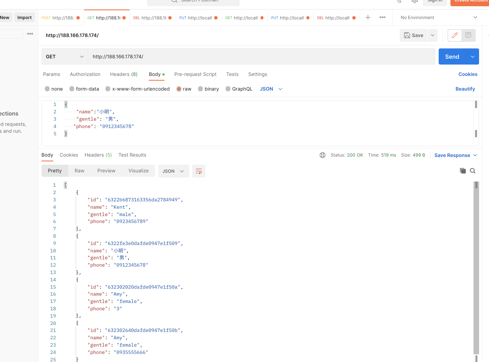
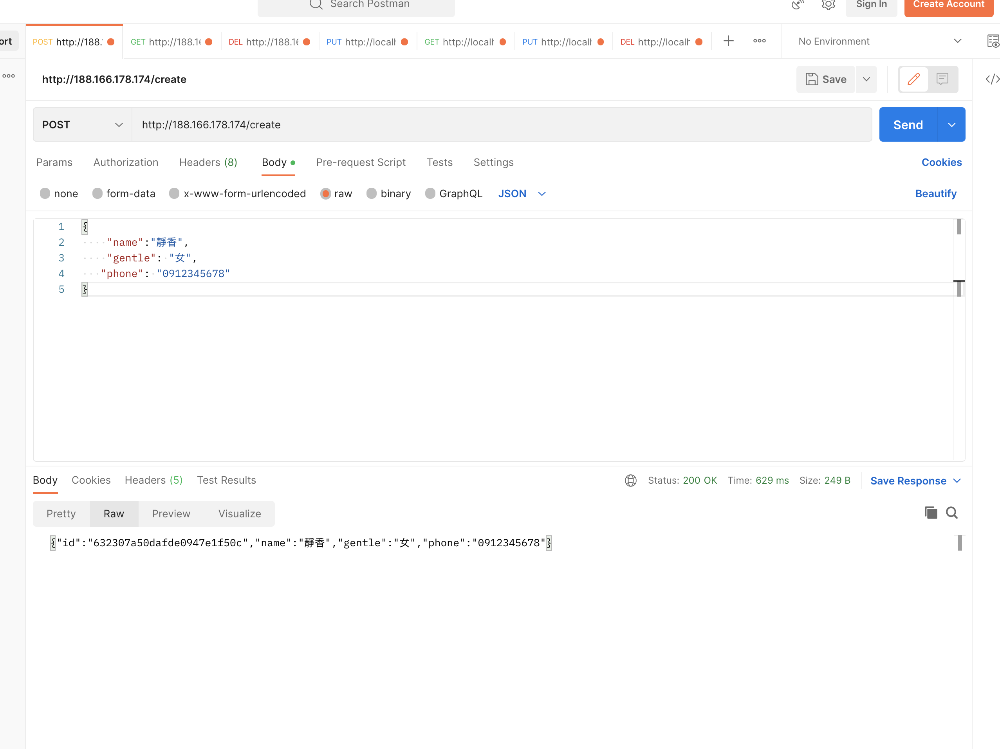
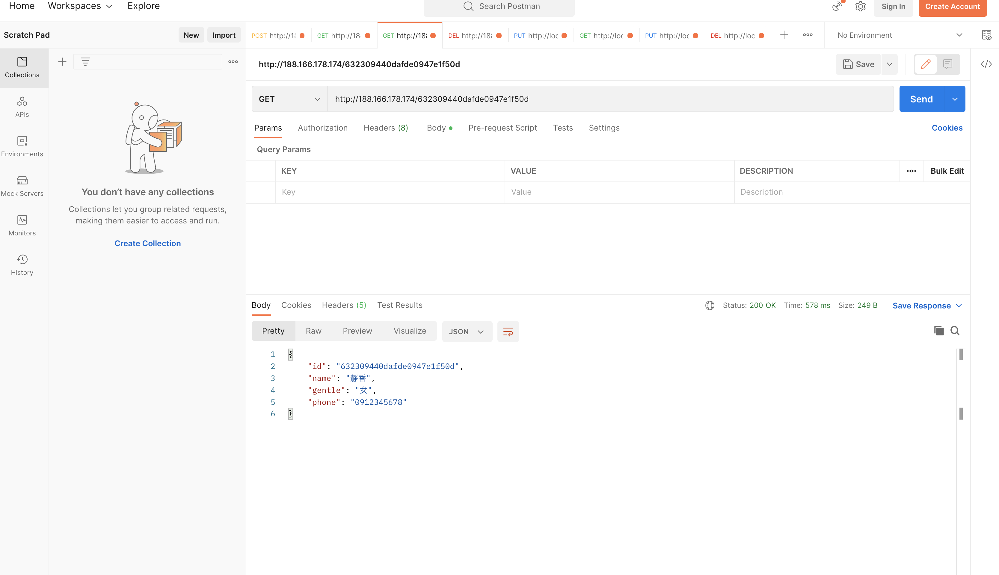
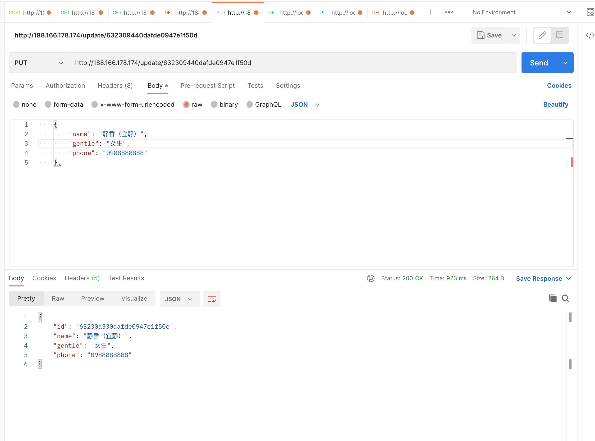
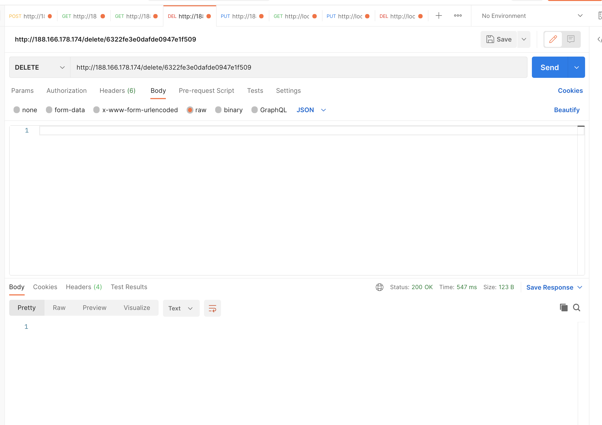
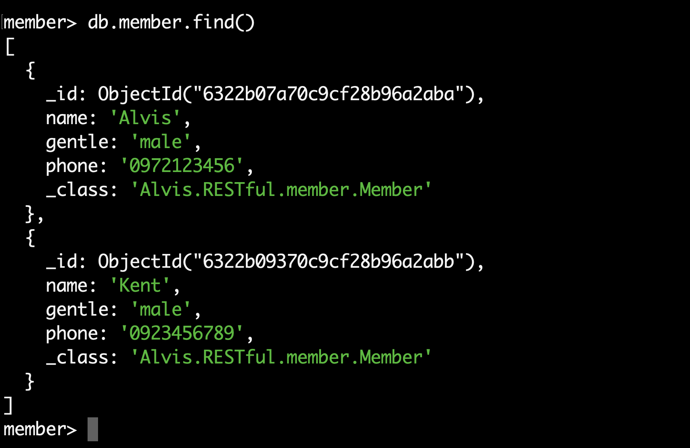

# RESTfulMember   DEMO  柯O銘  


### Read 讀取DB中所有member 於 http://188.166.178.174/使用GET

http://188.166.178.174/

在terminal使用curl以下commmand:

```
curl -i -X GET -H "Content-Type:application/json" http://188.166.178.174
```


### Create 使用POST 於 http://188.166.178.174/create/

http://188.166.178.174/create

在terminal使用curl以下commmand:

```
curl -i -X POST -H "Content-Type:application/json" -d "{ \"name\" : \"Amy\", \"gentle\" : \"female\",  \"phone\" : \"0912345678\" }" http://188.166.178.174/create
```

```
curl -i -X POST -H "Content-Type:application/json" -d "{ \"name\" : \"葉大雄\", \"gentle\" : \"男\",  \"phone\" : \"0912345678\" }" http://188.166.178.174/create
```

範例結果：

```
HTTP/1.1 200 
Content-Type: application/json
Transfer-Encoding: chunked
Date: Thu, 15 Sep 2022 10:45:56 GMT

{"id":"632302640dafde0947e1f50b","name":"Amy","gentle":"female","phone":"0935555666"}
```


### Read 使用GET 於 http://188.166.178.174/{memberID}

在terminal使用curl以下commmand:

```
curl -i -X GET -H "Content-Type:application/json" http://188.166.178.174/632302640dafde0947e1f50b
```


### Update  使用PUT 於 http://188.166.178.174/update/{memberID}

memberID 由 http://188.166.178.174/ GET例出時可查到monogoDB自產的ID

在terminal使用curl以下commmand代入**更新**id為632302020dafde0947e1f50a的資料:

```
curl -i -X PUT -H "Content-Type:application/json" -d "{ \"id\": \"632302020dafde0947e1f50a\",\"name\" : \"Amy\", \"gentle\" : \"female\",  \"phone\" : \"0935555666\" }" http://188.166.178.174/update/632302020dafde0947e1f50a
```


### Delete 使用DELETE 於 http://188.166.178.174/{memberID}

memberID 由 http://188.166.178.174/ GET例出時可查到monogoDB自產的ID

在terminal使用curl以下commmand代入**刪除**id為632302020dafde0947e1f50a的資料:


## 可以用POSTMAN進行： 

#### 

Read 讀取DB中所有member 於 http://188.166.178.174/使用GET




Create 使用POST 於 http://188.166.178.174/create/




Read 使用GET 於 http://188.166.178.174/{memberID}





Update  使用PUT 於 http://188.166.178.174/update/{memberID}




Delete 使用DELETE 於 http://188.166.178.174/{memberID}




若進到mongosh中使用於法查詢可以查到資料。



## 將./gradlew build 產生的JAR執行檔，使用docker打包，檔案位於build/libs/RESTful.member-0.0.1-SNAPSHOT.jar 

用Dockerfile 拉下java 17jdk image 並 copy   build/libs/RESTful.movies-0.0.1-SNAPSHOT.jar 成app.jar執行， build成image 。

```
FROM openjdk:17
copy build/libs/RESTful.member-0.0.1-SNAPSHOT.jar app.jar
ENTRYPOINT ["java","-jar","/app.jar"]
```

## 使用docker-compose 進行部署。

```
version: '3.7'
services:
  java-api:
    build:
      context: ./
      dockerfile: Dockerfile
    ports:
      - "80:8080"
    container_name: java-api
    links:
      - mongo-db
    depends_on:
      - "mongo-db"
    restart: unless-stopped
  mongo-db:
    image: mongo
    ports:
      - "27018:27017"
    container_name: mongo-db
    volumes:
      - ./db/:/data/db
    restart: unless-stopped
```


# 安裝步驟：

在有安裝docker環境的linux中，wget下載zip(git clone)專案解壓縮後，於RESTfulMember-master專案根目錄下執行 command 即可。

```
docker-compose up -d
```

